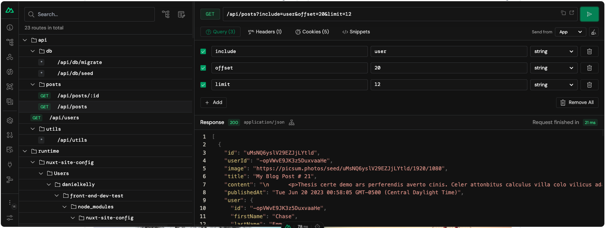

# Posts API Endpoints

## List Posts

To get the blog posts you can make requests to `/api/posts`.

### Query String Variables

You can customize the response to your needs with the following query string variables.

- **limit** - limit the number of posts returned (default 10)
- **offset** - offset the search by x (good for pagination)
- **include** - include a relationship (only valid value is "user")
- **order** - order by publishedAt desc or ascending. (valid values are `newestFirst` or `oldestFirst`)
- **select** - the post properties to include as a comma seperated list

#### Example

```
useFetch('/api/posts', {
    query: {
        limit: 20,
        offset: 40,
        include: 'user'
        order: 'oldestFirst',
        select: "id,title,content,excerpt,publishedAt,image,content,user.firstName, user.lastName, user.avatar, user.email",
    }
})
```

## Get One Post

To get the blog posts you can make requests to `/api/posts/[id]`.

#### Example

```
useFetch(`/api/posts/${id}`)
```

### Query String Variables

You can customize the response to your needs with the following query string variables.

- **include** - include a relationship (only valid value is "user")

### More Info

You can use the Nuxt devtools to explore this API endpoint further.


